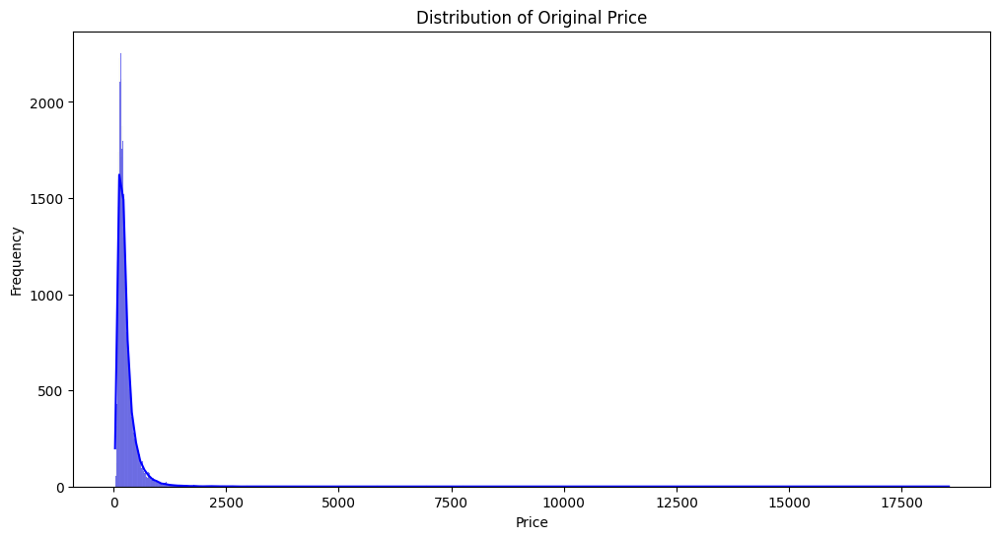
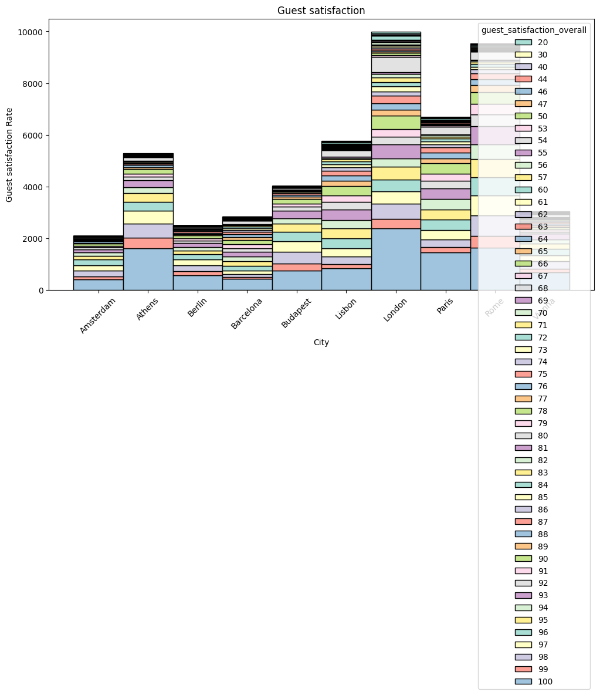

```python
import pandas as pd
import numpy as np
import seaborn as sns
import matplotlib.pyplot as plt
from scipy.stats import pearsonr
from scipy.stats import skew
```


```python
#-Import the data directly from google drive instead of saving it locally.

excel_file= pd.ExcelFile("https://docs.google.com/spreadsheets/d/1ecopK6oyyb4d_7-QLrCr8YlgFrCetHU7-VQfnYej7JY/export/format=csv")
```


```python
print(excel_file.sheet_names)
```

    ['amsterdam_weekdays', 'amsterdam_weekends', 'athens_weekdays', 'athens_weekends', 'berlin_weekends', 'berlin_weekdays', 'barcelona_weekdays', 'barcelona_weekends', 'budapest_weekdays', 'budapest_weekends', 'lisbon_weekdays', 'lisbon_weekends', 'london_weekdays', 'london_weekends', 'paris_weekdays', 'paris_weekends', 'rome_weekdays', 'rome_weekends', 'vienna_weekdays', 'vienna_weekends']


```python
city_data = ['amsterdam_weekdays', 'amsterdam_weekends', 'athens_weekdays', 'athens_weekends', 
             'berlin_weekends', 'berlin_weekdays', 'barcelona_weekdays', 'barcelona_weekends', 
             'budapest_weekdays', 'budapest_weekends', 'lisbon_weekdays', 'lisbon_weekends', 
             'london_weekdays', 'london_weekends', 'paris_weekdays', 'paris_weekends', 
             'rome_weekdays', 'rome_weekends', 'vienna_weekdays', 'vienna_weekends']

```


```python
for c in city_data[:]:  
    print(f"{c} = excel_file.parse('{c}')")
```

    amsterdam_weekdays = excel_file.parse('amsterdam_weekdays')
    amsterdam_weekends = excel_file.parse('amsterdam_weekends')
    athens_weekdays = excel_file.parse('athens_weekdays')
    athens_weekends = excel_file.parse('athens_weekends')
    berlin_weekends = excel_file.parse('berlin_weekends')
    berlin_weekdays = excel_file.parse('berlin_weekdays')
    barcelona_weekdays = excel_file.parse('barcelona_weekdays')
    barcelona_weekends = excel_file.parse('barcelona_weekends')
    budapest_weekdays = excel_file.parse('budapest_weekdays')
    budapest_weekends = excel_file.parse('budapest_weekends')
    lisbon_weekdays = excel_file.parse('lisbon_weekdays')
    lisbon_weekends = excel_file.parse('lisbon_weekends')
    london_weekdays = excel_file.parse('london_weekdays')
    london_weekends = excel_file.parse('london_weekends')
    paris_weekdays = excel_file.parse('paris_weekdays')
    paris_weekends = excel_file.parse('paris_weekends')
    rome_weekdays = excel_file.parse('rome_weekdays')
    rome_weekends = excel_file.parse('rome_weekends')
    vienna_weekdays = excel_file.parse('vienna_weekdays')
    vienna_weekends = excel_file.parse('vienna_weekends')


```python
amsterdam_weekdays = excel_file.parse('amsterdam_weekdays')
amsterdam_weekends = excel_file.parse('amsterdam_weekends')
athens_weekdays = excel_file.parse('athens_weekdays')
athens_weekends = excel_file.parse('athens_weekends')
berlin_weekends = excel_file.parse('berlin_weekends')
berlin_weekdays = excel_file.parse('berlin_weekdays')
barcelona_weekdays = excel_file.parse('barcelona_weekdays')
barcelona_weekends = excel_file.parse('barcelona_weekends')
budapest_weekdays = excel_file.parse('budapest_weekdays')
budapest_weekends = excel_file.parse('budapest_weekends')
lisbon_weekdays = excel_file.parse('lisbon_weekdays')
lisbon_weekends = excel_file.parse('lisbon_weekends')
london_weekdays = excel_file.parse('london_weekdays')
london_weekends = excel_file.parse('london_weekends')
paris_weekdays = excel_file.parse('paris_weekdays')
paris_weekends = excel_file.parse('paris_weekends')
rome_weekdays = excel_file.parse('rome_weekdays')
rome_weekends = excel_file.parse('rome_weekends')
vienna_weekdays = excel_file.parse('vienna_weekdays')
vienna_weekends = excel_file.parse('vienna_weekends')
```


```python
#-Merge all the tables into a single dataframe
dfs = {}

for c in city_data:
    dfs[c] = excel_file.parse(c)

alldf = pd.concat(dfs.values(), ignore_index=False)
```


```python
alldf
```


<div>
<style scoped>
    .dataframe tbody tr th:only-of-type {
        vertical-align: middle;
    }

    .dataframe tbody tr th {
        vertical-align: top;
    }

    .dataframe thead th {
        text-align: right;
    }
</style>
<table border="1" class="dataframe">
  <thead>
    <tr style="text-align: right;">
      <th></th>
      <th>Unnamed: 0</th>
      <th>realSum</th>
      <th>room_type</th>
      <th>room_shared</th>
      <th>room_private</th>
      <th>person_capacity</th>
      <th>host_is_superhost</th>
      <th>multi</th>
      <th>biz</th>
      <th>cleanliness_rating</th>
      <th>guest_satisfaction_overall</th>
      <th>bedrooms</th>
      <th>dist</th>
      <th>metro_dist</th>
      <th>attr_index</th>
      <th>attr_index_norm</th>
      <th>rest_index</th>
      <th>rest_index_norm</th>
      <th>lng</th>
      <th>lat</th>
    </tr>
  </thead>
  <tbody>
    <tr>
      <th>0</th>
      <td>0</td>
      <td>194.033698</td>
      <td>Private room</td>
      <td>False</td>
      <td>True</td>
      <td>2</td>
      <td>False</td>
      <td>1</td>
      <td>0</td>
      <td>10</td>
      <td>93</td>
      <td>1</td>
      <td>5.022964</td>
      <td>2.539380</td>
      <td>78.690379</td>
      <td>4.166708</td>
      <td>98.253896</td>
      <td>6.846473</td>
      <td>4.90569</td>
      <td>52.41772</td>
    </tr>
    <tr>
      <th>1</th>
      <td>1</td>
      <td>344.245776</td>
      <td>Private room</td>
      <td>False</td>
      <td>True</td>
      <td>4</td>
      <td>False</td>
      <td>0</td>
      <td>0</td>
      <td>8</td>
      <td>85</td>
      <td>1</td>
      <td>0.488389</td>
      <td>0.239404</td>
      <td>631.176378</td>
      <td>33.421209</td>
      <td>837.280757</td>
      <td>58.342928</td>
      <td>4.90005</td>
      <td>52.37432</td>
    </tr>
    <tr>
      <th>2</th>
      <td>2</td>
      <td>264.101422</td>
      <td>Private room</td>
      <td>False</td>
      <td>True</td>
      <td>2</td>
      <td>False</td>
      <td>0</td>
      <td>1</td>
      <td>9</td>
      <td>87</td>
      <td>1</td>
      <td>5.748312</td>
      <td>3.651621</td>
      <td>75.275877</td>
      <td>3.985908</td>
      <td>95.386955</td>
      <td>6.646700</td>
      <td>4.97512</td>
      <td>52.36103</td>
    </tr>
    <tr>
      <th>3</th>
      <td>3</td>
      <td>433.529398</td>
      <td>Private room</td>
      <td>False</td>
      <td>True</td>
      <td>4</td>
      <td>False</td>
      <td>0</td>
      <td>1</td>
      <td>9</td>
      <td>90</td>
      <td>2</td>
      <td>0.384862</td>
      <td>0.439876</td>
      <td>493.272534</td>
      <td>26.119108</td>
      <td>875.033098</td>
      <td>60.973565</td>
      <td>4.89417</td>
      <td>52.37663</td>
    </tr>
    <tr>
      <th>4</th>
      <td>4</td>
      <td>485.552926</td>
      <td>Private room</td>
      <td>False</td>
      <td>True</td>
      <td>2</td>
      <td>True</td>
      <td>0</td>
      <td>0</td>
      <td>10</td>
      <td>98</td>
      <td>1</td>
      <td>0.544738</td>
      <td>0.318693</td>
      <td>552.830324</td>
      <td>29.272733</td>
      <td>815.305740</td>
      <td>56.811677</td>
      <td>4.90051</td>
      <td>52.37508</td>
    </tr>
    <tr>
      <th>...</th>
      <td>...</td>
      <td>...</td>
      <td>...</td>
      <td>...</td>
      <td>...</td>
      <td>...</td>
      <td>...</td>
      <td>...</td>
      <td>...</td>
      <td>...</td>
      <td>...</td>
      <td>...</td>
      <td>...</td>
      <td>...</td>
      <td>...</td>
      <td>...</td>
      <td>...</td>
      <td>...</td>
      <td>...</td>
      <td>...</td>
    </tr>
    <tr>
      <th>1794</th>
      <td>1794</td>
      <td>715.938574</td>
      <td>Entire home/apt</td>
      <td>False</td>
      <td>False</td>
      <td>6</td>
      <td>False</td>
      <td>0</td>
      <td>1</td>
      <td>10</td>
      <td>100</td>
      <td>3</td>
      <td>0.530181</td>
      <td>0.135447</td>
      <td>219.402478</td>
      <td>15.712158</td>
      <td>438.756874</td>
      <td>10.604584</td>
      <td>16.37940</td>
      <td>48.21136</td>
    </tr>
    <tr>
      <th>1795</th>
      <td>1795</td>
      <td>304.793960</td>
      <td>Entire home/apt</td>
      <td>False</td>
      <td>False</td>
      <td>2</td>
      <td>False</td>
      <td>0</td>
      <td>0</td>
      <td>8</td>
      <td>86</td>
      <td>1</td>
      <td>0.810205</td>
      <td>0.100839</td>
      <td>204.970121</td>
      <td>14.678608</td>
      <td>342.182813</td>
      <td>8.270427</td>
      <td>16.38070</td>
      <td>48.20296</td>
    </tr>
    <tr>
      <th>1796</th>
      <td>1796</td>
      <td>637.168969</td>
      <td>Entire home/apt</td>
      <td>False</td>
      <td>False</td>
      <td>2</td>
      <td>False</td>
      <td>0</td>
      <td>0</td>
      <td>10</td>
      <td>93</td>
      <td>1</td>
      <td>0.994051</td>
      <td>0.202539</td>
      <td>169.073402</td>
      <td>12.107921</td>
      <td>282.296424</td>
      <td>6.822996</td>
      <td>16.38568</td>
      <td>48.20460</td>
    </tr>
    <tr>
      <th>1797</th>
      <td>1797</td>
      <td>301.054157</td>
      <td>Private room</td>
      <td>False</td>
      <td>True</td>
      <td>2</td>
      <td>False</td>
      <td>0</td>
      <td>0</td>
      <td>10</td>
      <td>87</td>
      <td>1</td>
      <td>3.044100</td>
      <td>0.287435</td>
      <td>109.236574</td>
      <td>7.822803</td>
      <td>158.563398</td>
      <td>3.832416</td>
      <td>16.34100</td>
      <td>48.19200</td>
    </tr>
    <tr>
      <th>1798</th>
      <td>1798</td>
      <td>133.230489</td>
      <td>Private room</td>
      <td>False</td>
      <td>True</td>
      <td>4</td>
      <td>True</td>
      <td>1</td>
      <td>0</td>
      <td>10</td>
      <td>93</td>
      <td>1</td>
      <td>1.263932</td>
      <td>0.480903</td>
      <td>150.450381</td>
      <td>10.774264</td>
      <td>225.247293</td>
      <td>5.444140</td>
      <td>16.39066</td>
      <td>48.20811</td>
    </tr>
  </tbody>
</table>
<p>51707 rows × 20 columns</p>
</div>


```python
alldf = pd.DataFrame(alldf)
```


```python
#-Create a column for city, country, and weekday/weekend 
cities = ['Amsterdam'] * 1103 + ['Amsterdam'] * 977 + ['Athens'] * 2653 + ['Athens'] * 2627 +['Berlin'] * 1200 +['Berlin'] * 1294 +['Barcelona'] * 1555 +['Barcelona'] * 1278 +['Budapest'] * 2074 +['Budapest'] * 1948 +['Lisbon'] * 2857 +['Lisbon'] * 2906 +['London'] * 4614+['London'] * 5379+['Paris'] * 3130+['Paris'] * 3558 +['Rome'] * 4992+['Rome'] * 4535+['Vienna'] * 1738+['Vienna']*1799
alldf['City'] = cities[:len(alldf)]


countries = ['Netherland']* 2080 +['Greece'] *5280 +['Germany']*2494 + ['Spain']*2833 +['Hungary']* 4022 +['Portogual'] *5763 +['England'] *9993 +['France']* 6688+ ['Italy'] *9527+ ['Austlia'] * 3027
alldf['Country'] = countries[:len(alldf)]

weekday_weekend = ['weekday'] * 1103 + ['weekend'] * 977 + ['weekday'] * 2653 + ['weekend'] * 2627 +['weekday'] * 1200 +['weekend'] * 1294 +['weekday'] * 1555 +['weekend'] * 1278 +['weekday'] * 2074 +['weekend'] * 1948 +['weekday'] * 2857 +['weekend'] * 2906 +['weekday'] * 4614+['weekend'] * 5379+['weekday'] * 3130+['weekend'] * 3558 +['weekday'] * 4992+['weekend'] * 4535+['weekday'] * 1738+['weekend']*1799
alldf['Weekday_Weekend'] = weekday_weekend[:len(alldf)]


```


```python
#length of column in each cties
len(alldf[alldf['City']== 'Vienna'])
```


    3027


```python
#-Change the name of realSum to Price
alldf.rename(columns={'realSum': 'Price'}, inplace=True)
```


```python
#-Remove first column
new_alldf = alldf.iloc[:, 1:]
new_alldf
```


<div>
<style scoped>
    .dataframe tbody tr th:only-of-type {
        vertical-align: middle;
    }

    .dataframe tbody tr th {
        vertical-align: top;
    }

    .dataframe thead th {
        text-align: right;
    }
</style>
<table border="1" class="dataframe">
  <thead>
    <tr style="text-align: right;">
      <th></th>
      <th>Price</th>
      <th>room_type</th>
      <th>room_shared</th>
      <th>room_private</th>
      <th>person_capacity</th>
      <th>host_is_superhost</th>
      <th>multi</th>
      <th>biz</th>
      <th>cleanliness_rating</th>
      <th>guest_satisfaction_overall</th>
      <th>...</th>
      <th>metro_dist</th>
      <th>attr_index</th>
      <th>attr_index_norm</th>
      <th>rest_index</th>
      <th>rest_index_norm</th>
      <th>lng</th>
      <th>lat</th>
      <th>City</th>
      <th>Country</th>
      <th>Weekday_Weekend</th>
    </tr>
  </thead>
  <tbody>
    <tr>
      <th>0</th>
      <td>194.033698</td>
      <td>Private room</td>
      <td>False</td>
      <td>True</td>
      <td>2</td>
      <td>False</td>
      <td>1</td>
      <td>0</td>
      <td>10</td>
      <td>93</td>
      <td>...</td>
      <td>2.539380</td>
      <td>78.690379</td>
      <td>4.166708</td>
      <td>98.253896</td>
      <td>6.846473</td>
      <td>4.90569</td>
      <td>52.41772</td>
      <td>Amsterdam</td>
      <td>Netherland</td>
      <td>weekday</td>
    </tr>
    <tr>
      <th>1</th>
      <td>344.245776</td>
      <td>Private room</td>
      <td>False</td>
      <td>True</td>
      <td>4</td>
      <td>False</td>
      <td>0</td>
      <td>0</td>
      <td>8</td>
      <td>85</td>
      <td>...</td>
      <td>0.239404</td>
      <td>631.176378</td>
      <td>33.421209</td>
      <td>837.280757</td>
      <td>58.342928</td>
      <td>4.90005</td>
      <td>52.37432</td>
      <td>Amsterdam</td>
      <td>Netherland</td>
      <td>weekday</td>
    </tr>
    <tr>
      <th>2</th>
      <td>264.101422</td>
      <td>Private room</td>
      <td>False</td>
      <td>True</td>
      <td>2</td>
      <td>False</td>
      <td>0</td>
      <td>1</td>
      <td>9</td>
      <td>87</td>
      <td>...</td>
      <td>3.651621</td>
      <td>75.275877</td>
      <td>3.985908</td>
      <td>95.386955</td>
      <td>6.646700</td>
      <td>4.97512</td>
      <td>52.36103</td>
      <td>Amsterdam</td>
      <td>Netherland</td>
      <td>weekday</td>
    </tr>
    <tr>
      <th>3</th>
      <td>433.529398</td>
      <td>Private room</td>
      <td>False</td>
      <td>True</td>
      <td>4</td>
      <td>False</td>
      <td>0</td>
      <td>1</td>
      <td>9</td>
      <td>90</td>
      <td>...</td>
      <td>0.439876</td>
      <td>493.272534</td>
      <td>26.119108</td>
      <td>875.033098</td>
      <td>60.973565</td>
      <td>4.89417</td>
      <td>52.37663</td>
      <td>Amsterdam</td>
      <td>Netherland</td>
      <td>weekday</td>
    </tr>
    <tr>
      <th>4</th>
      <td>485.552926</td>
      <td>Private room</td>
      <td>False</td>
      <td>True</td>
      <td>2</td>
      <td>True</td>
      <td>0</td>
      <td>0</td>
      <td>10</td>
      <td>98</td>
      <td>...</td>
      <td>0.318693</td>
      <td>552.830324</td>
      <td>29.272733</td>
      <td>815.305740</td>
      <td>56.811677</td>
      <td>4.90051</td>
      <td>52.37508</td>
      <td>Amsterdam</td>
      <td>Netherland</td>
      <td>weekday</td>
    </tr>
    <tr>
      <th>...</th>
      <td>...</td>
      <td>...</td>
      <td>...</td>
      <td>...</td>
      <td>...</td>
      <td>...</td>
      <td>...</td>
      <td>...</td>
      <td>...</td>
      <td>...</td>
      <td>...</td>
      <td>...</td>
      <td>...</td>
      <td>...</td>
      <td>...</td>
      <td>...</td>
      <td>...</td>
      <td>...</td>
      <td>...</td>
      <td>...</td>
      <td>...</td>
    </tr>
    <tr>
      <th>1794</th>
      <td>715.938574</td>
      <td>Entire home/apt</td>
      <td>False</td>
      <td>False</td>
      <td>6</td>
      <td>False</td>
      <td>0</td>
      <td>1</td>
      <td>10</td>
      <td>100</td>
      <td>...</td>
      <td>0.135447</td>
      <td>219.402478</td>
      <td>15.712158</td>
      <td>438.756874</td>
      <td>10.604584</td>
      <td>16.37940</td>
      <td>48.21136</td>
      <td>Vienna</td>
      <td>Austlia</td>
      <td>weekend</td>
    </tr>
    <tr>
      <th>1795</th>
      <td>304.793960</td>
      <td>Entire home/apt</td>
      <td>False</td>
      <td>False</td>
      <td>2</td>
      <td>False</td>
      <td>0</td>
      <td>0</td>
      <td>8</td>
      <td>86</td>
      <td>...</td>
      <td>0.100839</td>
      <td>204.970121</td>
      <td>14.678608</td>
      <td>342.182813</td>
      <td>8.270427</td>
      <td>16.38070</td>
      <td>48.20296</td>
      <td>Vienna</td>
      <td>Austlia</td>
      <td>weekend</td>
    </tr>
    <tr>
      <th>1796</th>
      <td>637.168969</td>
      <td>Entire home/apt</td>
      <td>False</td>
      <td>False</td>
      <td>2</td>
      <td>False</td>
      <td>0</td>
      <td>0</td>
      <td>10</td>
      <td>93</td>
      <td>...</td>
      <td>0.202539</td>
      <td>169.073402</td>
      <td>12.107921</td>
      <td>282.296424</td>
      <td>6.822996</td>
      <td>16.38568</td>
      <td>48.20460</td>
      <td>Vienna</td>
      <td>Austlia</td>
      <td>weekend</td>
    </tr>
    <tr>
      <th>1797</th>
      <td>301.054157</td>
      <td>Private room</td>
      <td>False</td>
      <td>True</td>
      <td>2</td>
      <td>False</td>
      <td>0</td>
      <td>0</td>
      <td>10</td>
      <td>87</td>
      <td>...</td>
      <td>0.287435</td>
      <td>109.236574</td>
      <td>7.822803</td>
      <td>158.563398</td>
      <td>3.832416</td>
      <td>16.34100</td>
      <td>48.19200</td>
      <td>Vienna</td>
      <td>Austlia</td>
      <td>weekend</td>
    </tr>
    <tr>
      <th>1798</th>
      <td>133.230489</td>
      <td>Private room</td>
      <td>False</td>
      <td>True</td>
      <td>4</td>
      <td>True</td>
      <td>1</td>
      <td>0</td>
      <td>10</td>
      <td>93</td>
      <td>...</td>
      <td>0.480903</td>
      <td>150.450381</td>
      <td>10.774264</td>
      <td>225.247293</td>
      <td>5.444140</td>
      <td>16.39066</td>
      <td>48.20811</td>
      <td>Vienna</td>
      <td>Austlia</td>
      <td>weekend</td>
    </tr>
  </tbody>
</table>
<p>51707 rows × 22 columns</p>
</div>


```python
new_alldf.count(0)
```


    Price                         51707
    room_type                     51707
    room_shared                   51707
    room_private                  51707
    person_capacity               51707
    host_is_superhost             51707
    multi                         51707
    biz                           51707
    cleanliness_rating            51707
    guest_satisfaction_overall    51707
    bedrooms                      51707
    dist                          51707
    metro_dist                    51707
    attr_index                    51707
    attr_index_norm               51707
    rest_index                    51707
    rest_index_norm               51707
    lng                           51707
    lat                           51707
    City                          51707
    Country                       51707
    Weekday_Weekend               51707
    dtype: int64


```python
'''
1. How many listings are in each city in total and also per type of day?
2. Which city has the biggest proportion of superhosts?
3. Which cities have listings with more than four rooms?
4. Which city has the most entire home/apt type listings?
5. Are ratings typically high across listings, or is there a wide variation?
6. How does person_capacity vary across listings? What is the most common capacity of listings?
7. Plot the distribution of realSum for both weekday and weekend offers. Is it normally distributed, skewed, or multimodal? If skewed, consider using transformations (e.g., log transformation) to normalize it.
8. Plot the distribution of guest_satisfaction_overall ratings. 
9. Examine the distribution of cleanliness_rating.
'''
```


    '\n1. How many listings are in each city in total and also per type of day?\n2. Which city has the biggest proportion of superhosts?\n3. Which cities have listings with more than four rooms?\n4. Which city has the most entire home/apt type listings?\n5. Are ratings typically high across listings, or is there a wide variation?\n6. How does person_capacity vary across listings? What is the most common capacity of listings?\n7. Plot the distribution of realSum for both weekday and weekend offers. Is it normally distributed, skewed, or multimodal? If skewed, consider using transformations (e.g., log transformation) to normalize it.\n8. Plot the distribution of guest_satisfaction_overall ratings.\xa0\n9. Examine the distribution of cleanliness_rating.\n'


```python
new_alldf
```


<div>
<style scoped>
    .dataframe tbody tr th:only-of-type {
        vertical-align: middle;
    }

    .dataframe tbody tr th {
        vertical-align: top;
    }

    .dataframe thead th {
        text-align: right;
    }
</style>
<table border="1" class="dataframe">
  <thead>
    <tr style="text-align: right;">
      <th></th>
      <th>Price</th>
      <th>room_type</th>
      <th>room_shared</th>
      <th>room_private</th>
      <th>person_capacity</th>
      <th>host_is_superhost</th>
      <th>multi</th>
      <th>biz</th>
      <th>cleanliness_rating</th>
      <th>guest_satisfaction_overall</th>
      <th>...</th>
      <th>metro_dist</th>
      <th>attr_index</th>
      <th>attr_index_norm</th>
      <th>rest_index</th>
      <th>rest_index_norm</th>
      <th>lng</th>
      <th>lat</th>
      <th>City</th>
      <th>Country</th>
      <th>Weekday_Weekend</th>
    </tr>
  </thead>
  <tbody>
    <tr>
      <th>0</th>
      <td>194.033698</td>
      <td>Private room</td>
      <td>False</td>
      <td>True</td>
      <td>2</td>
      <td>False</td>
      <td>1</td>
      <td>0</td>
      <td>10</td>
      <td>93</td>
      <td>...</td>
      <td>2.539380</td>
      <td>78.690379</td>
      <td>4.166708</td>
      <td>98.253896</td>
      <td>6.846473</td>
      <td>4.90569</td>
      <td>52.41772</td>
      <td>Amsterdam</td>
      <td>Netherland</td>
      <td>weekday</td>
    </tr>
    <tr>
      <th>1</th>
      <td>344.245776</td>
      <td>Private room</td>
      <td>False</td>
      <td>True</td>
      <td>4</td>
      <td>False</td>
      <td>0</td>
      <td>0</td>
      <td>8</td>
      <td>85</td>
      <td>...</td>
      <td>0.239404</td>
      <td>631.176378</td>
      <td>33.421209</td>
      <td>837.280757</td>
      <td>58.342928</td>
      <td>4.90005</td>
      <td>52.37432</td>
      <td>Amsterdam</td>
      <td>Netherland</td>
      <td>weekday</td>
    </tr>
    <tr>
      <th>2</th>
      <td>264.101422</td>
      <td>Private room</td>
      <td>False</td>
      <td>True</td>
      <td>2</td>
      <td>False</td>
      <td>0</td>
      <td>1</td>
      <td>9</td>
      <td>87</td>
      <td>...</td>
      <td>3.651621</td>
      <td>75.275877</td>
      <td>3.985908</td>
      <td>95.386955</td>
      <td>6.646700</td>
      <td>4.97512</td>
      <td>52.36103</td>
      <td>Amsterdam</td>
      <td>Netherland</td>
      <td>weekday</td>
    </tr>
    <tr>
      <th>3</th>
      <td>433.529398</td>
      <td>Private room</td>
      <td>False</td>
      <td>True</td>
      <td>4</td>
      <td>False</td>
      <td>0</td>
      <td>1</td>
      <td>9</td>
      <td>90</td>
      <td>...</td>
      <td>0.439876</td>
      <td>493.272534</td>
      <td>26.119108</td>
      <td>875.033098</td>
      <td>60.973565</td>
      <td>4.89417</td>
      <td>52.37663</td>
      <td>Amsterdam</td>
      <td>Netherland</td>
      <td>weekday</td>
    </tr>
    <tr>
      <th>4</th>
      <td>485.552926</td>
      <td>Private room</td>
      <td>False</td>
      <td>True</td>
      <td>2</td>
      <td>True</td>
      <td>0</td>
      <td>0</td>
      <td>10</td>
      <td>98</td>
      <td>...</td>
      <td>0.318693</td>
      <td>552.830324</td>
      <td>29.272733</td>
      <td>815.305740</td>
      <td>56.811677</td>
      <td>4.90051</td>
      <td>52.37508</td>
      <td>Amsterdam</td>
      <td>Netherland</td>
      <td>weekday</td>
    </tr>
    <tr>
      <th>...</th>
      <td>...</td>
      <td>...</td>
      <td>...</td>
      <td>...</td>
      <td>...</td>
      <td>...</td>
      <td>...</td>
      <td>...</td>
      <td>...</td>
      <td>...</td>
      <td>...</td>
      <td>...</td>
      <td>...</td>
      <td>...</td>
      <td>...</td>
      <td>...</td>
      <td>...</td>
      <td>...</td>
      <td>...</td>
      <td>...</td>
      <td>...</td>
    </tr>
    <tr>
      <th>1794</th>
      <td>715.938574</td>
      <td>Entire home/apt</td>
      <td>False</td>
      <td>False</td>
      <td>6</td>
      <td>False</td>
      <td>0</td>
      <td>1</td>
      <td>10</td>
      <td>100</td>
      <td>...</td>
      <td>0.135447</td>
      <td>219.402478</td>
      <td>15.712158</td>
      <td>438.756874</td>
      <td>10.604584</td>
      <td>16.37940</td>
      <td>48.21136</td>
      <td>Vienna</td>
      <td>Austlia</td>
      <td>weekend</td>
    </tr>
    <tr>
      <th>1795</th>
      <td>304.793960</td>
      <td>Entire home/apt</td>
      <td>False</td>
      <td>False</td>
      <td>2</td>
      <td>False</td>
      <td>0</td>
      <td>0</td>
      <td>8</td>
      <td>86</td>
      <td>...</td>
      <td>0.100839</td>
      <td>204.970121</td>
      <td>14.678608</td>
      <td>342.182813</td>
      <td>8.270427</td>
      <td>16.38070</td>
      <td>48.20296</td>
      <td>Vienna</td>
      <td>Austlia</td>
      <td>weekend</td>
    </tr>
    <tr>
      <th>1796</th>
      <td>637.168969</td>
      <td>Entire home/apt</td>
      <td>False</td>
      <td>False</td>
      <td>2</td>
      <td>False</td>
      <td>0</td>
      <td>0</td>
      <td>10</td>
      <td>93</td>
      <td>...</td>
      <td>0.202539</td>
      <td>169.073402</td>
      <td>12.107921</td>
      <td>282.296424</td>
      <td>6.822996</td>
      <td>16.38568</td>
      <td>48.20460</td>
      <td>Vienna</td>
      <td>Austlia</td>
      <td>weekend</td>
    </tr>
    <tr>
      <th>1797</th>
      <td>301.054157</td>
      <td>Private room</td>
      <td>False</td>
      <td>True</td>
      <td>2</td>
      <td>False</td>
      <td>0</td>
      <td>0</td>
      <td>10</td>
      <td>87</td>
      <td>...</td>
      <td>0.287435</td>
      <td>109.236574</td>
      <td>7.822803</td>
      <td>158.563398</td>
      <td>3.832416</td>
      <td>16.34100</td>
      <td>48.19200</td>
      <td>Vienna</td>
      <td>Austlia</td>
      <td>weekend</td>
    </tr>
    <tr>
      <th>1798</th>
      <td>133.230489</td>
      <td>Private room</td>
      <td>False</td>
      <td>True</td>
      <td>4</td>
      <td>True</td>
      <td>1</td>
      <td>0</td>
      <td>10</td>
      <td>93</td>
      <td>...</td>
      <td>0.480903</td>
      <td>150.450381</td>
      <td>10.774264</td>
      <td>225.247293</td>
      <td>5.444140</td>
      <td>16.39066</td>
      <td>48.20811</td>
      <td>Vienna</td>
      <td>Austlia</td>
      <td>weekend</td>
    </tr>
  </tbody>
</table>
<p>51707 rows × 22 columns</p>
</div>


```python
list(new_alldf)
```


    ['Price',
     'room_type',
     'room_shared',
     'room_private',
     'person_capacity',
     'host_is_superhost',
     'multi',
     'biz',
     'cleanliness_rating',
     'guest_satisfaction_overall',
     'bedrooms',
     'dist',
     'metro_dist',
     'attr_index',
     'attr_index_norm',
     'rest_index',
     'rest_index_norm',
     'lng',
     'lat',
     'City',
     'Country',
     'Weekday_Weekend']


```python
num_list = (1103,977,2653,2627,1200,1284,1555,1278,2074,1948,2857,2906,4614,5379,3130,3558,4492,4535,1738,1799)

df = pd.DataFrame({'Number of listing': num_list, 'Cities': city_data})
print(df)

```

        Number of listing              Cities
    0                1103  amsterdam_weekdays
    1                 977  amsterdam_weekends
    2                2653     athens_weekdays
    3                2627     athens_weekends
    4                1200     berlin_weekends
    5                1284     berlin_weekdays
    6                1555  barcelona_weekdays
    7                1278  barcelona_weekends
    8                2074   budapest_weekdays
    9                1948   budapest_weekends
    10               2857     lisbon_weekdays
    11               2906     lisbon_weekends
    12               4614     london_weekdays
    13               5379     london_weekends
    14               3130      paris_weekdays
    15               3558      paris_weekends
    16               4492       rome_weekdays
    17               4535       rome_weekends
    18               1738     vienna_weekdays
    19               1799     vienna_weekends


```python
#1. How many listings are in each city in total and also per type of day?
city_listing = new_alldf['City'].value_counts().reset_index(name='Number of Listings')
city_listing.columns = ['City', 'Number of Listings']
city_listing
```


<div>
<style scoped>
    .dataframe tbody tr th:only-of-type {
        vertical-align: middle;
    }

    .dataframe tbody tr th {
        vertical-align: top;
    }

    .dataframe thead th {
        text-align: right;
    }
</style>
<table border="1" class="dataframe">
  <thead>
    <tr style="text-align: right;">
      <th></th>
      <th>City</th>
      <th>Number of Listings</th>
    </tr>
  </thead>
  <tbody>
    <tr>
      <th>0</th>
      <td>London</td>
      <td>9993</td>
    </tr>
    <tr>
      <th>1</th>
      <td>Rome</td>
      <td>9527</td>
    </tr>
    <tr>
      <th>2</th>
      <td>Paris</td>
      <td>6688</td>
    </tr>
    <tr>
      <th>3</th>
      <td>Lisbon</td>
      <td>5763</td>
    </tr>
    <tr>
      <th>4</th>
      <td>Athens</td>
      <td>5280</td>
    </tr>
    <tr>
      <th>5</th>
      <td>Budapest</td>
      <td>4022</td>
    </tr>
    <tr>
      <th>6</th>
      <td>Vienna</td>
      <td>3027</td>
    </tr>
    <tr>
      <th>7</th>
      <td>Barcelona</td>
      <td>2833</td>
    </tr>
    <tr>
      <th>8</th>
      <td>Berlin</td>
      <td>2494</td>
    </tr>
    <tr>
      <th>9</th>
      <td>Amsterdam</td>
      <td>2080</td>
    </tr>
  </tbody>
</table>
</div>


```python
type_count =new_alldf['room_type'].value_counts()
print(type_count)
```

    Entire home/apt    32648
    Private room       18693
    Shared room          366
    Name: room_type, dtype: int64


```python
room_counts = new_alldf.groupby(['City', 'room_type']).size().reset_index(name='Count')
room_counts
```


<div>
<style scoped>
    .dataframe tbody tr th:only-of-type {
        vertical-align: middle;
    }

    .dataframe tbody tr th {
        vertical-align: top;
    }

    .dataframe thead th {
        text-align: right;
    }
</style>
<table border="1" class="dataframe">
  <thead>
    <tr style="text-align: right;">
      <th></th>
      <th>City</th>
      <th>room_type</th>
      <th>Count</th>
    </tr>
  </thead>
  <tbody>
    <tr>
      <th>0</th>
      <td>Amsterdam</td>
      <td>Entire home/apt</td>
      <td>1126</td>
    </tr>
    <tr>
      <th>1</th>
      <td>Amsterdam</td>
      <td>Private room</td>
      <td>944</td>
    </tr>
    <tr>
      <th>2</th>
      <td>Amsterdam</td>
      <td>Shared room</td>
      <td>10</td>
    </tr>
    <tr>
      <th>3</th>
      <td>Athens</td>
      <td>Entire home/apt</td>
      <td>4872</td>
    </tr>
    <tr>
      <th>4</th>
      <td>Athens</td>
      <td>Private room</td>
      <td>397</td>
    </tr>
    <tr>
      <th>5</th>
      <td>Athens</td>
      <td>Shared room</td>
      <td>11</td>
    </tr>
    <tr>
      <th>6</th>
      <td>Barcelona</td>
      <td>Entire home/apt</td>
      <td>549</td>
    </tr>
    <tr>
      <th>7</th>
      <td>Barcelona</td>
      <td>Private room</td>
      <td>2272</td>
    </tr>
    <tr>
      <th>8</th>
      <td>Barcelona</td>
      <td>Shared room</td>
      <td>12</td>
    </tr>
    <tr>
      <th>9</th>
      <td>Berlin</td>
      <td>Entire home/apt</td>
      <td>885</td>
    </tr>
    <tr>
      <th>10</th>
      <td>Berlin</td>
      <td>Private room</td>
      <td>1536</td>
    </tr>
    <tr>
      <th>11</th>
      <td>Berlin</td>
      <td>Shared room</td>
      <td>73</td>
    </tr>
    <tr>
      <th>12</th>
      <td>Budapest</td>
      <td>Entire home/apt</td>
      <td>3582</td>
    </tr>
    <tr>
      <th>13</th>
      <td>Budapest</td>
      <td>Private room</td>
      <td>426</td>
    </tr>
    <tr>
      <th>14</th>
      <td>Budapest</td>
      <td>Shared room</td>
      <td>14</td>
    </tr>
    <tr>
      <th>15</th>
      <td>Lisbon</td>
      <td>Entire home/apt</td>
      <td>3877</td>
    </tr>
    <tr>
      <th>16</th>
      <td>Lisbon</td>
      <td>Private room</td>
      <td>1812</td>
    </tr>
    <tr>
      <th>17</th>
      <td>Lisbon</td>
      <td>Shared room</td>
      <td>74</td>
    </tr>
    <tr>
      <th>18</th>
      <td>London</td>
      <td>Entire home/apt</td>
      <td>4388</td>
    </tr>
    <tr>
      <th>19</th>
      <td>London</td>
      <td>Private room</td>
      <td>5555</td>
    </tr>
    <tr>
      <th>20</th>
      <td>London</td>
      <td>Shared room</td>
      <td>50</td>
    </tr>
    <tr>
      <th>21</th>
      <td>Paris</td>
      <td>Entire home/apt</td>
      <td>5066</td>
    </tr>
    <tr>
      <th>22</th>
      <td>Paris</td>
      <td>Private room</td>
      <td>1528</td>
    </tr>
    <tr>
      <th>23</th>
      <td>Paris</td>
      <td>Shared room</td>
      <td>94</td>
    </tr>
    <tr>
      <th>24</th>
      <td>Rome</td>
      <td>Entire home/apt</td>
      <td>5963</td>
    </tr>
    <tr>
      <th>25</th>
      <td>Rome</td>
      <td>Private room</td>
      <td>3551</td>
    </tr>
    <tr>
      <th>26</th>
      <td>Rome</td>
      <td>Shared room</td>
      <td>13</td>
    </tr>
    <tr>
      <th>27</th>
      <td>Vienna</td>
      <td>Entire home/apt</td>
      <td>2340</td>
    </tr>
    <tr>
      <th>28</th>
      <td>Vienna</td>
      <td>Private room</td>
      <td>672</td>
    </tr>
    <tr>
      <th>29</th>
      <td>Vienna</td>
      <td>Shared room</td>
      <td>15</td>
    </tr>
  </tbody>
</table>
</div>


```python
plt.figure(figsize=(12, 6))
sns.histplot(data=new_alldf, x='City', hue='room_type', multiple='stack', palette='Set2')
plt.xticks(rotation=45)
plt.title('Roomtypes of the day ')
plt.xlabel('City')
plt.ylabel('Rooms')
# Most of the cities have a great number of either private room or entire/home apartment :
# Cities that have more numbers of Entire/home aprtment: Amsterdam, Athens,Budapest, Lisbon, Paris, Rome Vienna
# Cities that have more numbers of　Pricate room : Barcerona, London
#-> There are no patterns can be seen(e.g. such as the correlations between the specific room type and geographical location)

```


    Text(0, 0.5, 'Rooms')


    

    


```python
#2. Which city has the biggest proportion of superhosts?
#-> the answer is Rome: 3136
superhost_count_by_city = new_alldf.groupby('City')['host_is_superhost'].sum().reset_index(name='Superhost Count')
superhost_count_by_city
```


<div>
<style scoped>
    .dataframe tbody tr th:only-of-type {
        vertical-align: middle;
    }

    .dataframe tbody tr th {
        vertical-align: top;
    }

    .dataframe thead th {
        text-align: right;
    }
</style>
<table border="1" class="dataframe">
  <thead>
    <tr style="text-align: right;">
      <th></th>
      <th>City</th>
      <th>Superhost Count</th>
    </tr>
  </thead>
  <tbody>
    <tr>
      <th>0</th>
      <td>Amsterdam</td>
      <td>591</td>
    </tr>
    <tr>
      <th>1</th>
      <td>Athens</td>
      <td>2263</td>
    </tr>
    <tr>
      <th>2</th>
      <td>Barcelona</td>
      <td>516</td>
    </tr>
    <tr>
      <th>3</th>
      <td>Berlin</td>
      <td>640</td>
    </tr>
    <tr>
      <th>4</th>
      <td>Budapest</td>
      <td>1525</td>
    </tr>
    <tr>
      <th>5</th>
      <td>Lisbon</td>
      <td>1231</td>
    </tr>
    <tr>
      <th>6</th>
      <td>London</td>
      <td>1574</td>
    </tr>
    <tr>
      <th>7</th>
      <td>Paris</td>
      <td>940</td>
    </tr>
    <tr>
      <th>8</th>
      <td>Rome</td>
      <td>3136</td>
    </tr>
    <tr>
      <th>9</th>
      <td>Vienna</td>
      <td>816</td>
    </tr>
  </tbody>
</table>
</div>


```python
plt.figure(figsize=(12, 6))
sns.histplot(data=new_alldf, x='City', hue='host_is_superhost',multiple='stack',palette='Set2')
plt.xticks(rotation=45)
plt.title('Superhost True or False')
plt.xlabel('City')
plt.ylabel('Frequency')

#Most of the cities have more accomodations that are not aproved as "host is superhost" 
# The numbers of true in Athens and Budapest outnumber the ones of false
```


    Text(0, 0.5, 'Frequency')


    

    


```python
#3. Which cities have listings with more than four rooms?-> The capacity of the room is more than 4 persons?
#-> the answer is London: 36


filtered_df = new_alldf[new_alldf['bedrooms'] >= 4]
capacity_count = filtered_df.groupby('City').size().reset_index(name='bedroom ≥ 4')
capacity_count

# The availability of bedrooms for more than 4 people are limited: over 15= Amsterdam, Lisbon,London, Rome
# 
```


<div>
<style scoped>
    .dataframe tbody tr th:only-of-type {
        vertical-align: middle;
    }

    .dataframe tbody tr th {
        vertical-align: top;
    }

    .dataframe thead th {
        text-align: right;
    }
</style>
<table border="1" class="dataframe">
  <thead>
    <tr style="text-align: right;">
      <th></th>
      <th>City</th>
      <th>bedroom ≥ 4</th>
    </tr>
  </thead>
  <tbody>
    <tr>
      <th>0</th>
      <td>Amsterdam</td>
      <td>20</td>
    </tr>
    <tr>
      <th>1</th>
      <td>Athens</td>
      <td>2</td>
    </tr>
    <tr>
      <th>2</th>
      <td>Barcelona</td>
      <td>4</td>
    </tr>
    <tr>
      <th>3</th>
      <td>Berlin</td>
      <td>5</td>
    </tr>
    <tr>
      <th>4</th>
      <td>Lisbon</td>
      <td>25</td>
    </tr>
    <tr>
      <th>5</th>
      <td>London</td>
      <td>36</td>
    </tr>
    <tr>
      <th>6</th>
      <td>Paris</td>
      <td>7</td>
    </tr>
    <tr>
      <th>7</th>
      <td>Rome</td>
      <td>17</td>
    </tr>
    <tr>
      <th>8</th>
      <td>Vienna</td>
      <td>6</td>
    </tr>
  </tbody>
</table>
</div>


```python
#4. Which city has the most entire home/apt type listings?
#-> Rome 5963

entire_home_apt_df = new_alldf[new_alldf['room_type'] == 'Entire home/apt']
entire_home_apt_count_by_city = entire_home_apt_df.groupby('City').size().reset_index(name='Entire Home/Apt Count')
entire_home_apt_count_by_city
# - The accomodations in Athens,Budapest, Lisbon, Paris, Rome, Londodn have greater absolute number in this category. 
```


<div>
<style scoped>
    .dataframe tbody tr th:only-of-type {
        vertical-align: middle;
    }

    .dataframe tbody tr th {
        vertical-align: top;
    }

    .dataframe thead th {
        text-align: right;
    }
</style>
<table border="1" class="dataframe">
  <thead>
    <tr style="text-align: right;">
      <th></th>
      <th>City</th>
      <th>Entire Home/Apt Count</th>
    </tr>
  </thead>
  <tbody>
    <tr>
      <th>0</th>
      <td>Amsterdam</td>
      <td>1126</td>
    </tr>
    <tr>
      <th>1</th>
      <td>Athens</td>
      <td>4872</td>
    </tr>
    <tr>
      <th>2</th>
      <td>Barcelona</td>
      <td>549</td>
    </tr>
    <tr>
      <th>3</th>
      <td>Berlin</td>
      <td>885</td>
    </tr>
    <tr>
      <th>4</th>
      <td>Budapest</td>
      <td>3582</td>
    </tr>
    <tr>
      <th>5</th>
      <td>Lisbon</td>
      <td>3877</td>
    </tr>
    <tr>
      <th>6</th>
      <td>London</td>
      <td>4388</td>
    </tr>
    <tr>
      <th>7</th>
      <td>Paris</td>
      <td>5066</td>
    </tr>
    <tr>
      <th>8</th>
      <td>Rome</td>
      <td>5963</td>
    </tr>
    <tr>
      <th>9</th>
      <td>Vienna</td>
      <td>2340</td>
    </tr>
  </tbody>
</table>
</div>


```python
#5. Are ratings typically high across listings, or is there a wide variation?
#-> Unclear


```


```python

```


```python
#6. How does person_capacity vary across listings? What is the most common capacity of listings?
#-> person capacities varies between 1 and 4.The commoncapacity is 2 people.
plt.figure(figsize=(12, 6))
sns.histplot(data=new_alldf, x='City', hue='person_capacity', multiple='stack', palette='Set2')
plt.xticks(rotation=45)
plt.title('Person Capacity Across Cities')
plt.xlabel('Person Capacity')
plt.ylabel('Rooms')

```


    Text(0, 0.5, 'Rooms')


    

    


```python

```


```python

```


```python

plt.figure(figsize=(12, 6))
sns.boxplot(x='City', y='person_capacity', data=new_alldf, palette='Set2')
plt.xticks(rotation=45)
plt.title('Person Capacity Across Cities')
plt.xlabel('City')
plt.ylabel('Person Capacity')
```


    Text(0, 0.5, 'Person Capacity')


    

    


```python
#7. Plot the distribution of realSum for both weekday and weekend offers.
#Is it normally distributed, skewed, or multimodal? 
#If skewed, consider using transformations (e.g., log transformation) to normalize it.

#-> skewed(Positive)

```


```python
sns.stripplot(x='Weekday_Weekend', y='Price', data=new_alldf, color='black', jitter=True, alpha=0.5)
plt.title('Price Distribution by Weekday vs Weekend (with Dots for Distribution)')
plt.xlabel('Weekday/Weekend')
plt.ylabel('Price')
```


    Text(0, 0.5, 'Price')


    

    


```python
price_skewness = skew(new_alldf['Price'])
print(f"Skewness of 'Price': {price_skewness:.4f}")


plt.figure(figsize=(12, 6))
sns.boxplot(x='Weekday_Weekend', y='Price', data=new_alldf, palette='Set2')

plt.title('Price Distribution by Weekday vs Weekend')
plt.xlabel('Weekday/Weekend')
plt.ylabel('Price')

```

    Skewness of 'Price': 21.4193


    Text(0, 0.5, 'Price')


    

    


```python
new_alldf.columns = new_alldf.columns.str.strip()
count_1_100 = ((new_alldf['Price'] > 1) & (new_alldf['Price'] < 100)).sum()
print(f"Number of listings with price in the range 1-100: {count_1_100}")

count_101_500 = ((new_alldf['Price'] > 100) & (new_alldf['Price'] < 500)).sum()
print(f"Number of listings with price in the range 101-500: {count_101_500}")
    
count_501_1000 = ((new_alldf['Price'] > 500) & (new_alldf['Price'] < 1000)).sum()
print(f"Number of listings with price in the range 501-1000: {count_501_1000}")

#- the the price range is between 1 and 1000
```

    Number of listings with price in the range 1-100: 3092
    Number of listings with price in the range 101-500: 43429
    Number of listings with price in the range 501-1000: 4415


```python

```


```python
plt.figure(figsize=(12, 6))
sns.histplot(new_alldf['Price'], kde=True, color='blue', label='Original Price')
plt.title('Distribution of Original Price')
plt.xlabel('Price')
plt.ylabel('Frequency')

new_alldf['log_Price'] = np.log(new_alldf['Price'])
log_price_skewness = skew(new_alldf['log_Price'])
print(f"Skewness of transformed 'Price' (log): {log_price_skewness:.4f}")

plt.figure(figsize=(12, 6))
sns.histplot(new_alldf['log_Price'], kde=True, color='red', label='Log Transformed Price')
plt.title('Distribution of Log Transformed Price')
plt.xlabel('Log(Price)')
plt.ylabel('Frequency')

new_alldf['sqrt_Price'] = np.sqrt(new_alldf['Price'])
sqrt_price_skewness = skew(new_alldf['sqrt_Price'])
print(f"Skewness of transformed 'Price' (sqrt): {sqrt_price_skewness:.4f}")


plt.figure(figsize=(12, 6))
sns.histplot(new_alldf['sqrt_Price'], kde=True, color='green', label='Square Root Transformed Price')
plt.title('Distribution of Square Root Transformed Price')
plt.xlabel('Sqrt(Price)')
plt.ylabel('Frequency')

```

    Skewness of transformed 'Price' (log): 0.7088
    Skewness of transformed 'Price' (sqrt): 3.4741


    Text(0, 0.5, 'Frequency')


    

    


    

    


    

    


```python
#8. Plot the distribution of guest_satisfaction_overall ratings.
#-> 
plt.figure(figsize=(12, 6))
sns.boxplot(x='City', y='guest_satisfaction_overall', data=new_alldf, palette='Set2')
plt.xticks(rotation=45)
plt.title('Guest Satisfaction Distribution Across Cities')
plt.xlabel('City')
plt.ylabel('Guest Satisfaction')
```


    Text(0, 0.5, 'Guest Satisfaction')


    

    


```python
 
plt.figure(figsize=(12, 6))
sns.histplot(data=new_alldf, x='City', hue='guest_satisfaction_overall', multiple='stack', palette='Set3')
plt.xticks(rotation=45)
plt.title('Guest satisfaction')
plt.xlabel('City')

plt.ylabel('Guest satisfaction Rate')


```


    Text(0, 0.5, 'Guest satisfaction Rate')


    

    


```python
#9. Examine the distribution of cleanliness_rating.
 
plt.figure(figsize=(12, 6))
sns.histplot(data=new_alldf, x='City', hue='cleanliness_rating', multiple='stack', palette='Set2')
plt.xticks(rotation=45)
plt.title('Cleanliness Rating Across Cities')
plt.xlabel('City')
plt.ylabel('Cleaning Rate')


plt.figure(figsize=(12, 6))
sns.boxplot(x='City', y='cleanliness_rating', data=new_alldf, palette='Set2')
plt.xticks(rotation=45)
plt.title('Cleanliness Rating Across Cities')
plt.xlabel('City')
plt.ylabel('Cleaning Rate')

#-> most of the cities aquired 10, follwing that rating 9 and 8. 
#The case rated lower than 7 are less than 7 in each cities. 

```


    Text(0, 0.5, 'Cleaning Rate')


    

    


    

    


```python

```


```python
'''
[Analysis Summary]
- The significant differences of the number of listing can barely seen between weekend and weekdays except London.
- There are no patterns can be seen(e.g. such as the correlations between the specific room type and geographical location)
- Person capacities varies between 1 and 4.The commoncapacity is 2 people.
- The price distribution is positively skewed, the price range is between 1 and 1000.
- The ratio of the super host does not correrate with the satisfaction.
- As majority of accomodations in all cities have great rate in cleanliness(more than 8), the cleanliness rate and guest satisfaction may correlate.  
'''
```


```python

```


```python

```


```python

```


```python

```
